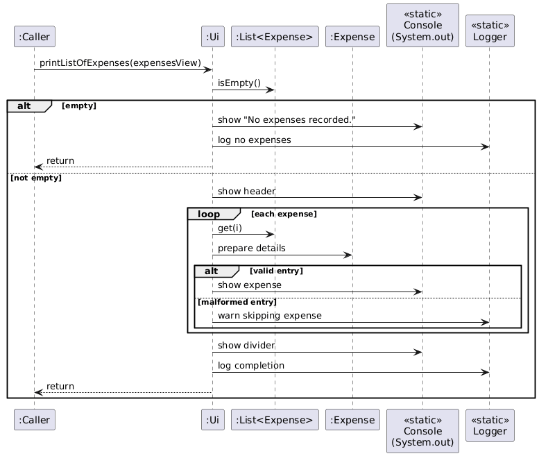
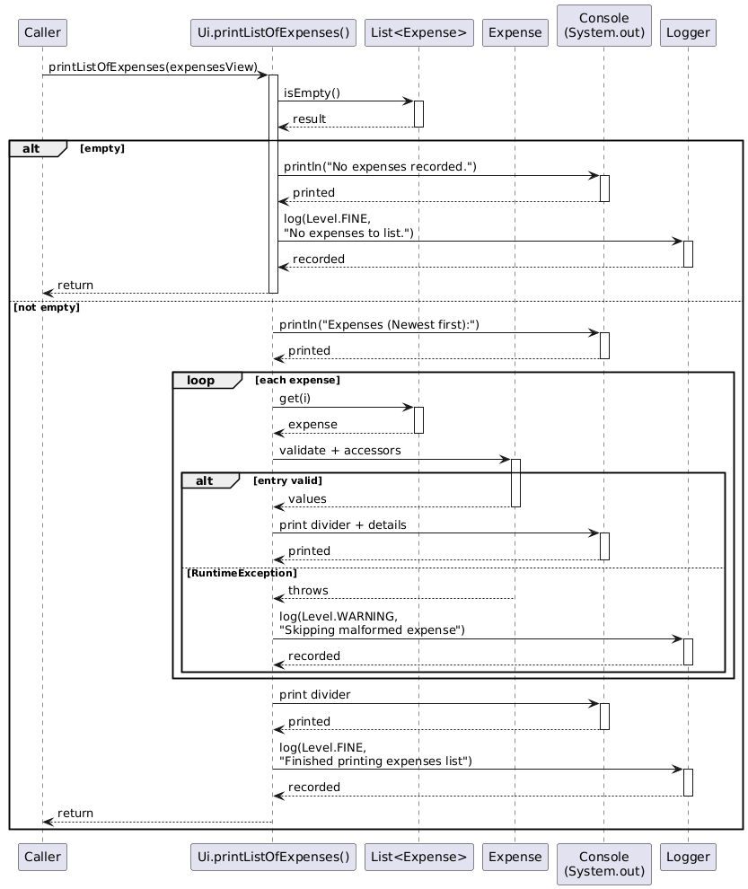

# Developer Guide

## Acknowledgements

{list here sources of all reused/adapted ideas, code, documentation, and third-party libraries -- include links to the original source as well}

## Design
This section describes the overall architecture and explores the core classes of FinTrack.

### Architecture

FinTrack adopts a layered architecture that keeps user interaction, parsing, application logic, and domain data clearly separated. The runtime flow for a typical command is:

1. `Ui` prompts for input and renders all textual feedback to the user.
2. `FinTrack` runs the command loop, routing the raw input to the relevant parser method.
3. `Parser` validates syntax, extracts parameters, and produces typed objects or primitives that the logic layer understands.
4. `FinanceManager` applies the requested operation to the in-memory state, which is organised by the classes in the `model` package (`Expense`, `Income`, their category enums, and list wrappers that enforce ordering and invariants).
5. The resulting state or any error messages are returned to `Ui` for display, keeping the rest of the system unaware of console concerns.

This separation keeps orchestrating code small, makes the parser and logic testable in isolation, and allows future enhancements (such as a GUI or persistence layer) to be introduced without rewriting existing modules.

### FinTrack Module (`FinTrack.java`)
`FinTrack` (`src/main/java/seedu/fintrack/FinTrack.java`) serves as the main entry point and the central controller of the application. It is responsible for managing the application's lifecycle and coordinating the interactions between the user interface (`Ui`), the business logic (`FinanceManager`), and the input processor (`Parser`). The `main` method executes a simple, continuous 'Read-Evaluate-Print' loop (REPL).

How the `FinTrack` component works:
1. The application starts by welcoming the user (via `Ui.printWelcome()`) and initialising the `FinanceManager`, which holds the application's state (all incomes, expenses and budgets).
2. It waits for user input using `Ui.waitForInput()`.
3. The input is parsed as follows:
    - The command word (e.g. `add-expense`) is extracted using `Parser.returnFirstWord()`.
    - A `switch` statement is used to route the command word to the appropriate logic block.
    - For commands that take no arguments (like `list`, `help` and `bye`), it uses the `hasUnexpectedArguments()` helper to validate the input before executing.
    - For commands that take arguments (like `add-expense`, `delete-income`, `budget`), it delegates the parsing of the entire input string to the `Parser` class (e.g. `Parser.parseAddExpense(input)`).
4. The relevant command is executed as follows:
    - If the `Parser` successfully returns a valid object (like an `Expense` or an `int`), `FinTrack` passes this object to the `FinanceManager` to perform the business logic (e.g. `fm.addExpense(expense)`).
    - Based on the result from `FinanceManager`, it then calls the appropriate `Ui` method to show success (e.g. `Ui.printExpenseAdded(expense)`).
    - Any `IllegalArgumentException` or `IndexOutOfBoundsException` (from `Parser` or `FinanceManager`) is caught within the loop. The error message is retrieved (`e.getMessage()`)
      and printed to the user via `Ui.printError()`.
5. The loop continues until the user enters the `bye` command (`Ui.EXIT_COMMAND`).

The above flow is illustrated by the sequence diagram below, showing how the `add-expense` command is processed.

Why `FinTrack` was implemented this way:
- **Separation of Concerns**: The `FinTrack` class acts purely as a controller. It doesn't know how to parse data (`Parser`), how to store data (`FinanceManager`), or how to display information (`Ui`). This makes the code highly modular and easy to maintain.
- **Centralised Error Handling**: By wrapping the command execution in a `try-catch` block, the application is resilient. A malformed command (which throws an `IllegalArgumentException` from `Parser`) doesn't crash the program; it simply prints an error and allows the user to try again.
- **Simplicity**: A `switch` statement on the command word is the most direct and readable wait to implement a REPL for this set of commands.

### Ui Module (`Ui.java`)

#### Console Facade Overview
`Ui` (`src/main/java/seedu/fintrack/Ui.java`) is the single entry point for all console interaction in FinTrack. The class is intentionally static: it exposes command keywords, reads raw user input, and renders every message shown to the user without requiring an object to be instantiated. This keeps the rest of the application (parser, command executors, and model layer) free from I/O concerns while guaranteeing that the console state is mutated from a single place.

#### Command Token Registry
All canonical command phrases and parameter prefixes (`HELP_COMMAND`, `ADD_EXPENSE_COMMAND`, `AMOUNT_PREFIX`, and others) are defined as `public static final` constants at the top of the class. Centralising the tokens avoids string drift between the parser, help text, and automated tests. Any new user-visible command must be added here first, followed by updates to `printHelp()` so the usage documentation always reflects reality.

#### Input Loop Integration
`waitForInput()` owns the blocking read from `System.in` via a shared `Scanner`. The method prints a consistent `> ` prompt, trims whitespace, and returns an empty string when the user simply presses enter. If the input stream is closed or the scanner encounters an illegal state, the method logs the failure (`SEVERE`) and returns `EXIT_COMMAND`; this sentinel gives the caller a deterministic way to trigger a graceful shutdown without duplicating exception handling logic. Unexpected runtime exceptions are rethrown after being logged so they can be surfaced during development.

#### Output Formatters
- **Shared helpers**: `printHorizontalLine(int length)` is the only low-level formatter. It validates its argument, asserts the precondition when assertions are enabled, and writes the divider used by the list renderers.
- **Welcome and exit**: `printWelcome()` and `printExit()` wrap the banner text with INFO-level logs so session start and end are traceable in diagnostic logs.
- **Error surface**: `printError(String message)` prefixes every failure with `"Error: "` for consistent user feedback and mirrors the message to the logger at `WARNING` level. The duplication means log archives can be searched without relying on console captures.

#### Domain Object Renderers
All methods that print `Expense`, `Income`, or `ExpenseCategory` objects follow the same pattern: enforce non-null preconditions with `Objects.requireNonNull`, assert numeric invariants (`Double.isFinite`), and render values with explicit formatting. `printIncomeAdded(...)`, `printExpenseAdded(...)`, `printIncomeModified(...)`, and `printExpenseModified(...)` display the canonical summary after create or update operations. The deletion counterparts (`printIncomeDeleted(...)`, `printExpenseDeleted(...)`) warn if an invalid index slips through so upstream callers can be fixed during testing. Optional descriptions are only printed when non-blank, avoiding empty shells in the console output.

#### Balance and Budget Reporting
`printBalance(...)` centralises the three-line financial summary, keeping the numeric formatting consistent across commands. Budget-related methods highlight different phases: `printBudgetSet(...)` acknowledges successful configuration, `printBudgetExceededWarning(...)` emits an attention-grabbing banner when the spending threshold is crossed, and `printBudgets(...)` lists all configured budgets sorted by category using `Map.entrySet().stream().sorted(...)`. Sorting within the formatter decouples presentation order from the underlying storage implementation and keeps the console output digestible.

#### List Views
`printListOfIncomes(...)` and `printListOfExpenses(...)` render collections supplied by the model. Both methods iterate defensively: each entry is validated inside the loop, and malformed records are skipped with a `WARNING` log instead of aborting the entire render. Income entries are printed oldest first to match insertion order, while expenses are shown newest first to surface recent spending. Each row is wrapped with a 50-character horizontal divider to improve readability, and dates are standardised to `yyyy-MM-dd` via a local `DateTimeFormatter`.

#### Logging and Diagnostics
A dedicated `java.util.logging.Logger` instance records every significant branch at either INFO, FINE, WARNING, or SEVERE. Verbose (`FINE`) messages are emitted after successful renders, making it easy to cross-check console output with the log file when troubleshooting. Assertions complement logging by surfacing programmer errors (e.g., negative indices) during development builds without affecting production behaviour when assertions are disabled.

#### Extensibility Notes
When introducing new user flows:
- Add command keywords and prefixes alongside the existing constants so the parser and help text can reuse them.
- Implement a formatter that mirrors the defensive style (`Objects.requireNonNull`, assertions, and logging) before wiring it into higher-level commands.
- Keep console writing confined to `Ui`; other classes should pass domain objects or DTOs into these helpers instead of printing directly.
- Update or extend unit tests around `Ui` to lock in the new formatting, especially when the output participates in regression tests or scripted demos.

Because every method is static (most with package-private visibility), they can be invoked directly from tests within the same package without faking I/O streams. If a future feature requires richer presentation (e.g., table layout or different locales), the current structure allows the helper methods to be swapped for formatter objects while preserving the public surface area exposed to the rest of the application.

### Parser Module (`Parser.java`)
`Parser` (`src/main/java/seedu/fintrack/Parser.java`) is a stateless utility class (marked `final` with a `private` constructor) responsible for transforming raw user `String` input into structured validated data objects.

How the `Parser` component works:
1. The private `getValue(String args, String prefix)` method is the core of the parser. It works by:
    - Finding the start of a given prefix (e.g. `a/`).
    - Finding the start of the next known prefix (e.g. `c/`) using the `findNextPrefixIndex()` helper.
    - Extracting the substring between these two points as the value. This logic allows the user to provide arguments in any order (e.g. `c/food a/10` is the same as `a/10 c/food`).
2. Methods like `parseAddExpense(input)` orchestrate the parsing process:
    - The command word (e.g. `add-expense`) is stripped from the input string.
    - `getValue()` is called for each required argument (e.g. `a/`, `c/`, `d/`). If any return `null`, an `IllegalArgumentException` is thrown.
    - `getOptionalValue()` (a null-safe wrapper for `getValue()`) is called for optional arguments (e.g. `desc/`).
    - Type conversion and validation is performed on the extracted string values (e.g. `Double.parseDouble()`, `LocalDate.parse()`, `ExpenseCategory.parse()`).
    - If all validations pass, they construct and return the new data object (e.g. `new Expense(...)`). If any validation fails (e.g. `NumberFormatException`), it is caught and re-thrown as an `IllegalArgumentException` with a user-friendly message.
3. Methods like `parseDeleteExpense(input)` are simpler. The command word is simply stripped and the remaining string is parsed as a positive integer.

The internal logic for `parseAddExpense` is shown below:

Why `Parser` was implemented this way:
- **Single Responsibility Principle (SRP)**: The `Parser` class is a good example of SRP, as it only knows how to parse strings. It has no knowledge of `FinanceManager`, storage, or how the `Ui` works. This makes it independently testable and reusable.
- **Defensive Programming**: The `Parser` is the application's first line of defense against bad user input. It is designed to be extremely strict, throwing an `IllegalArgumentException` for any deviation from the expected format. This simplifies the rest of the application, as `FinTrack` and `FinanceManager` can trust that any object they receive from the `Parser` is valid.
- **Stateless Utility**: By making the class `final` with a `private` constructor and all `static` methods, we enforce that it's a stateless utility. There is no need to create an instance of a `Parser`, which simplifies the design.

Alternatives considered:
- **Positional Parsing**: An alternative design would be to use positional parsing (e.g. `add-expense 10 food 2025-10-22`). This was rejected as it's rigid and not user-friendly; the user must remember the exact order of arguments. The chosen prefix-based system (`a/`, `c/`) is more flexible.
- **Regex Parsing**: Another alternative was to use complex Regular Expressions (Regex) for each command. This was deemed harder to maintain and debug compared to the current prefix-scanning approach.

## Implementation
This section describes some noteworthy details of how certain features are implemented.

### Budget (`budget and list-budget`)
The budget feature allows us to set budgets for our expenses which lets us set a budget for a certain category. When we set a budget using `budget c/{ExpenseCategory} a/{amount}`, we get warned when any expense using `add-expense` we make exceeds our budget. Finally, we can see all the budgets we have set through `list-budget`.

Here is how `budget` and `list-budget` works:
1. In `FinTrack`, `Parser` first handles our input by recognising the budget function and then parsing the input into `ExpenseCategory` and budget amount.
2. To store all our budgets, we create a HashMap called `budgets` which has `ExpenseCategory` as the key and the budget amount as the value.
3. A function `setBudget` is then called to set the budget for the input category. Finally, `Ui` calls `printBudgetSet()` to indicate budget has been set.
4. Now, when `addExpense()` is called during `add-expense`, a boolean called `budgetExceeded` checks for if the added expense exceeds the budget set for that category. If so, a warning is printed by `printBudgetExceededWarning()` in `Ui`.
5. When `list-budget` is called, `Ui` prints a list of the budgets by calling `printBudgets` which receives a printable version of all the budgets which we get from `getBudgetsView()`.

Below is the sequence diagram of an instance of `budget` and `add-expense`:

#### Design Considerations:
- We considered alternative ways to hold our budgets such as arrays, however, for the sake of readability and simplicity, we went with a HashMap

### Summary (`summary-expense and summary-income`)
The summary feature comes in two forms:
- `summary-expense`: gives a brief summary of overall expense
- `summary-income`: gives a brief summary of overall income

A summary consists of the following details:
- **Overall expense/income**
- **Breakdown by category**
- **Top Category**

Here is how `summary-expense` works:
1. We first consider what was needed in our summary. The main things we needed
   were total expenditure, a breakdown of expenditure and the top category in expenditure
2. To get total expense, we can get total expense from calling `getTotalExpense()` from `FinanceManager`.
3. To see how much the user has spent on each category, a function in `FinanceManager` called `getExpenseByCategory()` is implemented to return a HashMap which has `ExpenseCategory` as the key and the accumulated amount of that category as the value.
4. To create this hashmap, `getExpenseByCategory()` loops through all expenses in the `expenses` list and adds up the total amount for each `ExpenseCategory`.
5. `totalExpense` and `expenseByCategory` is then fed into a function in `Ui` called `printSummaryExpense` to print the summary.

Below is a sequence diagram to illustrate how summary-expense works:

`summary-income` is implemented in a similar way.

#### Design Considerations
- One thing we considered was how to implement this as simply as possible. While we recognise that the current implementation has a data-hungry implementation in a HashMap, it was also the simplest solution.
- This solution also helps to reduce coupling and improve testing of the implementation.

## Product scope
### Target user profile

{Describe the target user profile}

### Value proposition

{Describe the value proposition: what problem does it solve?}

## User Stories

|Version| As a ... | I want to ... | So that I can ...|
|--------|----------|---------------|------------------|
|v1.0|new user|see usage instructions|refer to them when I forget how to use the application|
|v2.0|user|find a to-do item by name|locate a to-do without having to go through the entire list|

## Non-Functional Requirements

{Give non-functional requirements}

## Glossary

* *glossary item* - Definition

## Instructions for manual testing

{Give instructions on how to do a manual product testing e.g., how to load sample data to be used for testing}
