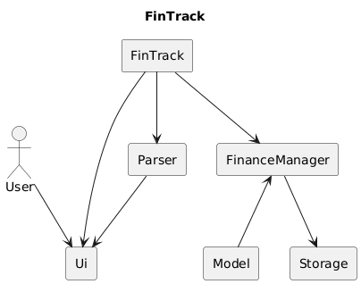
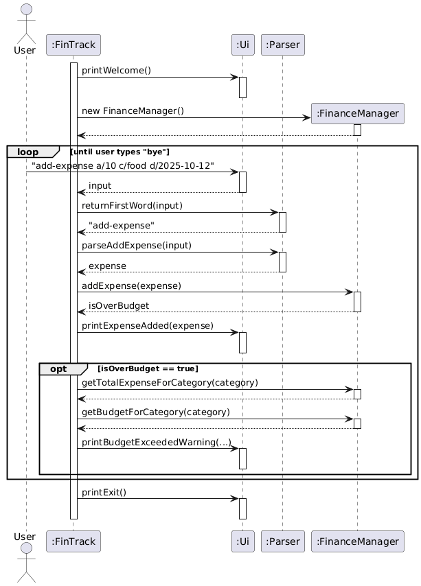
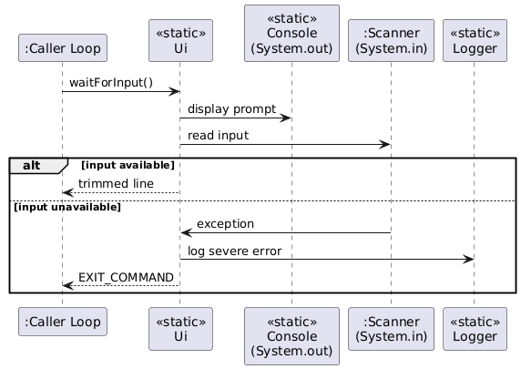
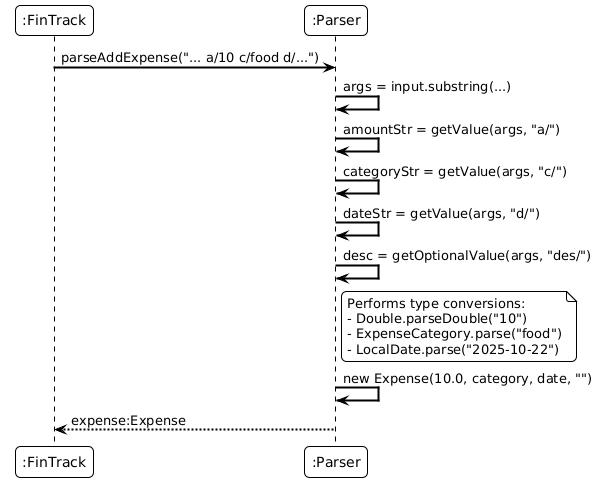
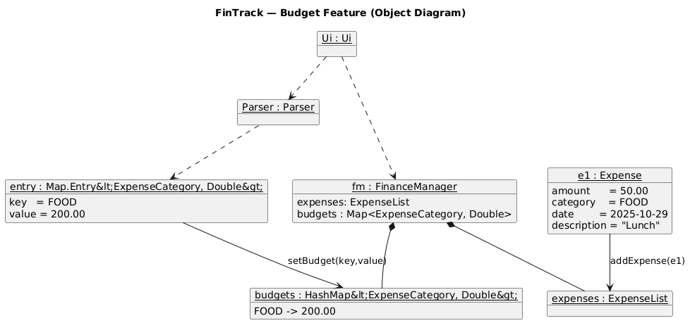
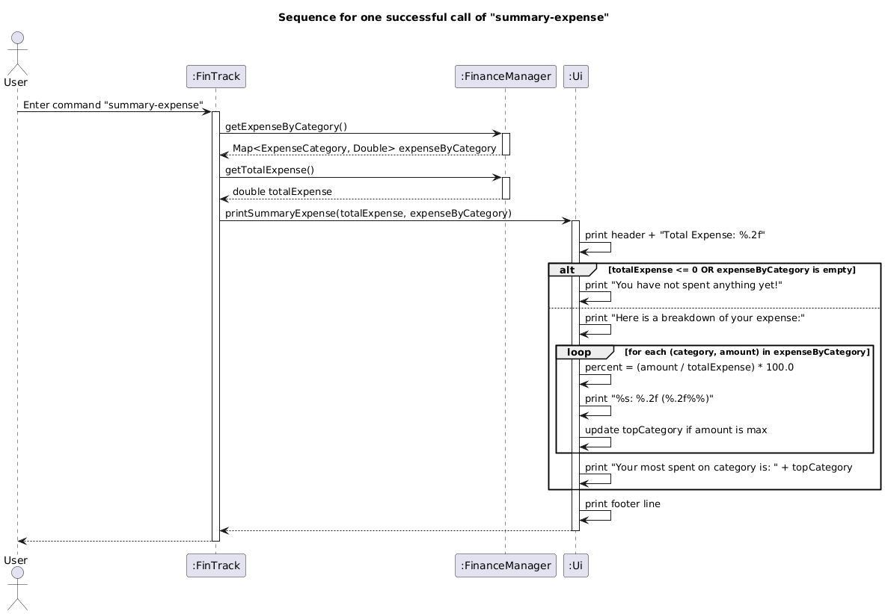
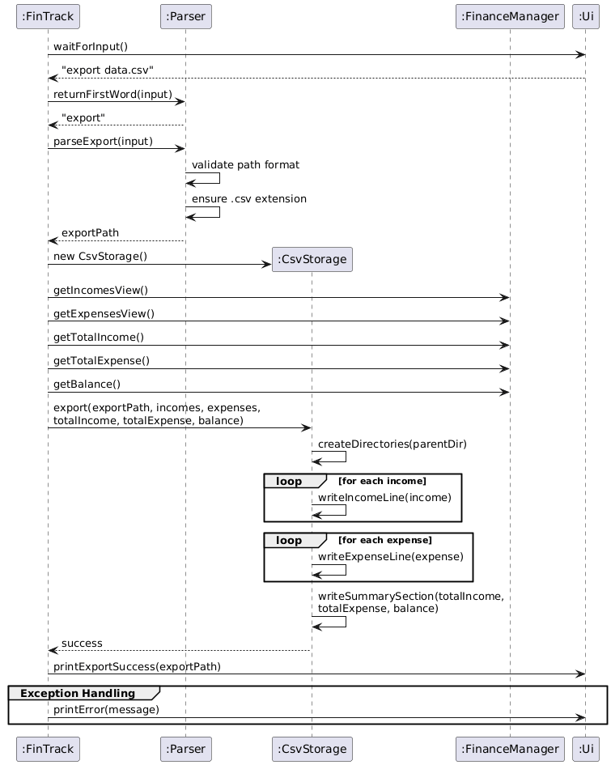
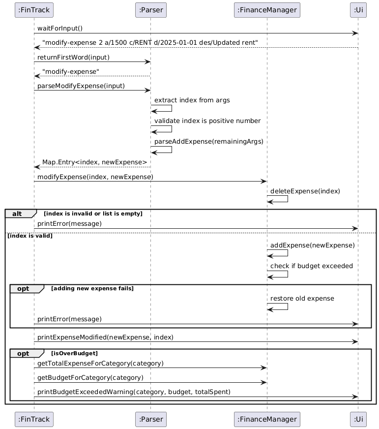
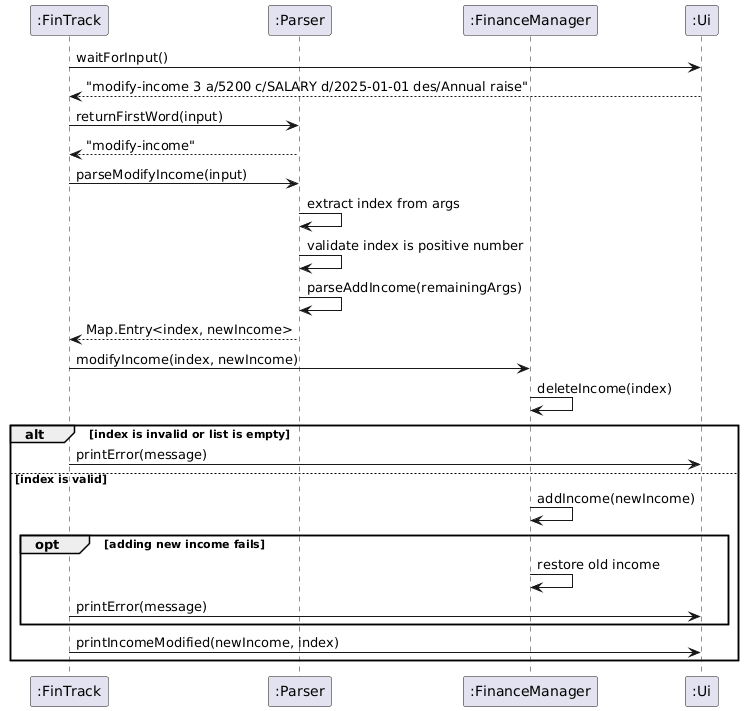

# Developer Guide

## Table of Contents
- [Acknowledgements](#acknowledgements)
- [Design](#design)
    - [Architecture](#architecture)
    - [FinTrack Module](#fintrack-module-fintrackjava)
    - [Ui Module](#ui-module-uijava)
    - [Parser Module](#parser-module-parserjava)
    - [FinanceManager Module](#financemanager-module-financemanagerjava)
- [Implementation](#implementation)
  - [Feature: Monthly Filtering](#monthly-filtering-balance-list-expense-list-income)
  - [Feature: Budget](#budget-budget-list-budget-and-delete-budget)
  - [Feature: Summary](#summary-summary-expense-and-summary-income)
  - [Feature: Persistence](#persistence-via-plaintextstorage)
  - [Feature: Export](#export-export)
  - [Feature: Modify](#modify-modify-expense-and-modify-income)
- [Appendix A: Product Scope](#appendix-a-product-scope)
- [Appendix B: User Stories](#appendix-b-user-stories)
- [Appendix C: Non-Functional Requirements](#appendix-c-non-functional-requirements)
- [Appendix D: Glossary](#appendix-d-glossary)
- [Appendix E: Instructions for Manual Testing](#appendix-e-instructions-for-manual-testing)
- [Appendix F: Known Issues](#appendix-f-known-issues)

## Acknowledgements

We would like to thank our TA, Chen Siyu, and the rest of the CS2113 teaching team for their hard work and guidance!

## Design

This section describes the overall architecture and explores the core classes of FinTrack.

### Architecture



The Architecture Diagram above shows the high-level design of FinTrack.

FinTrack adopts a layered architecture that keeps user interaction, parsing, application logic, and domain data clearly separated. The runtime flow for a typical command is:

1. `Ui` prompts for input and renders all textual feedback to the user.
2. `FinTrack` runs the command loop, routing the raw input to the relevant parser method.
3. `Parser` validates syntax, extracts parameters, and produces typed objects or primitives that the logic layer understands.
4. `FinanceManager` applies the requested operation to the in-memory state, which is organised by the classes in the `model` package (`Expense`, `Income`, their category enums, and list wrappers that enforce ordering and invariants).
5. The resulting state or any error messages are returned to `Ui` for display, keeping the rest of the system unaware of console concerns.

This separation keeps orchestrating code small, makes the parser and logic testable in isolation, and allows future enhancements (such as a GUI or persistence layer) to be introduced without rewriting existing modules.

### FinTrack Module (`FinTrack.java`)
`FinTrack` (`src/main/java/seedu/fintrack/FinTrack.java`) serves as the main entry point and the central controller of the application. It is responsible for managing the application's lifecycle and coordinating the interactions between the user interface (`Ui`), the business logic (`FinanceManager`), and the input processor (`Parser`). The `main` method executes a simple, continuous 'Read-Evaluate-Print' loop (REPL).

The class diagram below captures how `FinTrack` coordinates the main components that drive the command loop, and
how they depend on one another.


- `FinTrack` orchestrates the CLI loop: every iteration it invokes `Parser`, hands work to `FinanceManager`, and
  delegates presenting feedback to `Ui`.
    - `Parser` depends on the command prefixes declared in `Ui`, ensuring the parser and help
      text interpret CLI syntax the same way.
    - `Ui` centralises every user-facing token and message so other modules don't need to print directly to the console.
    - `FinanceManager` encapsulates all business logic, exposing the operations the rest of the app calls to manipulate/query financial data.
    - `PlainTextStorage` performs automatic load/save of the session data (`fintrack-data.txt`) before and after the command loop.
    - `CsvStorage` implements the `Storage` interface, handling exporting financial data to CSV format. `FinTrack` instantiates it by default when handling the `export`
      command.

How the `FinTrack` component works:

1. The application starts by initialising the `FinanceManager` (which holds the application's state e.g. incomes, expenses) and asking `PlainTextStorage` to populate it from the default persistence file (if present). The application proceeds to print the welcome banner (via `Ui.printWelcome()`).
2. It waits for user input using `Ui.waitForInput()`.
3. The input is parsed as follows:
    - The command word (e.g. `add-expense`) is extracted using `Parser.returnFirstWord()`.
    - A `switch` statement is used to route the command word to the appropriate logic block.
    - For commands that take no arguments (like `help` and `bye`), it uses the `hasUnexpectedArguments()` helper to validate the input before executing.
    - For commands that take arguments (like `add-expense`, `delete-income`, `budget`), it delegates the parsing of the entire input string to the `Parser` class (e.g. `Parser.parseAddExpense(input)`).
4. The relevant command is executed as follows:
    - If the `Parser` successfully returns a valid object (like an `Expense` or an `int`), `FinTrack` passes this object to the `FinanceManager` to perform the business logic (e.g. `fm.addExpense(expense)`).
    - Based on the result from `FinanceManager`, it then calls the appropriate `Ui` method to show success (e.g. `Ui.printExpenseAdded(expense)`).
    - Any `IllegalArgumentException` or `IndexOutOfBoundsException` (from `Parser` or `FinanceManager`) is caught within the loop. The error message is retrieved (`e.getMessage()`)
      and printed to the user via `Ui.printError()`.
5. The loop continues until the user enters the `bye` command (`Ui.EXIT_COMMAND`).
6. Before exiting, `FinTrack` calls `PlainTextStorage.save(...)` to save financial data to `fintrack-data.txt` when permissions allow writing.

The above flow is illustrated by the sequence diagram below, showing how the `add-expense` command is processed. Persistence is omitted for simplicity.



Why `FinTrack` was implemented this way:

- **Separation of Concerns**: The `FinTrack` class acts purely as a controller. It doesn't know how to parse data (`Parser`), how to store data (`FinanceManager`), or how to display information (`Ui`). This makes the code highly modular and easy to maintain.
- **Centralised Error Handling**: By wrapping the command execution in a `try-catch` block, the application is resilient. A malformed command (which throws an `IllegalArgumentException` from `Parser`) doesn't crash the program; it simply prints an error and allows the user to try again.
- **Simplicity**: A `switch` statement on the command word is the most direct and readable wait to implement a REPL for this set of commands.

### Ui Module (`Ui.java`)


The class diagram highlights how the static `Ui` utility coordinates with key collaborators. `TipsStorage` is owned by `Ui` for retrieving contextual tips, while `Expense`, `Income`, and their category enums are passed in from the model so renderer helpers can format domain objects without duplicating business logic.

#### Console Basics
`Ui` (`src/main/java/seedu/fintrack/Ui.java`) is the single entry point for all console interaction in FinTrack. The class is intentionally static: it exposes command keywords, reads raw user input, and renders every message shown to the user without requiring an object to be instantiated. This keeps the rest of the application (parser, command executors, and model layer) free from I/O concerns while guaranteeing that the console state is mutated from a single place.

#### Command Keywords
All canonical command phrases and parameter prefixes (`HELP_COMMAND`, `ADD_EXPENSE_COMMAND`, `AMOUNT_PREFIX`, and others) are defined as `public static final` constants at the top of the class. Centralising the tokens avoids string drift between the parser, help text, and automated tests. Any new user-visible command must be added here first, followed by updates to `printHelp()` so the usage documentation always reflects reality.

#### Reading User Input
`waitForInput()` owns the blocking read from `System.in` via a shared `Scanner`. The method prints a consistent `> ` prompt, trims whitespace, and returns an empty string when the user simply presses enter. If the input stream is closed or the scanner encounters an illegal state, the method logs the failure (`SEVERE`) and returns `EXIT_COMMAND`; this sentinel gives the caller a deterministic way to trigger a graceful shutdown without duplicating exception handling logic. Unexpected runtime exceptions are rethrown after being logged so they can be surfaced during development.



#### Output Formatters

- **Shared helpers**: `printHorizontalLine(int length)` is the only low-level formatter. It validates its argument, asserts the precondition when assertions are enabled, and writes the divider used by the list renderers.
- **Welcome and exit**: `printWelcome()` and `printExit()` wrap the banner text with INFO-level logs so session start and end are traceable in diagnostic logs.
- **Error surface**: `printError(String message)` prefixes every failure with `"Error: "` for consistent user feedback and mirrors the message to the logger at `WARNING` level. The duplication means log archives can be searched without relying on console captures.

#### Domain Object Renderers

All methods that print `Expense`, `Income`, or `ExpenseCategory` objects follow the same pattern: enforce non-null preconditions with `Objects.requireNonNull`, assert numeric invariants (`Double.isFinite`), and render values with explicit formatting. `printIncomeAdded(...)`, `printExpenseAdded(...)`, `printIncomeModified(...)`, and `printExpenseModified(...)` display the canonical summary after create or update operations. The deletion counterparts (`printIncomeDeleted(...)`, `printExpenseDeleted(...)`) warn if an invalid index slips through so upstream callers can be fixed during testing. Optional descriptions are only printed when non-blank, avoiding empty shells in the console output.

#### Balance and Budget Reporting

`printBalance(...)` centralises the three-line financial summary, keeping the numeric formatting consistent across commands. Budget-related methods highlight different phases: `printBudgetSet(...)` acknowledges successful configuration, `printBudgetExceededWarning(...)` emits an attention-grabbing banner when the spending threshold is crossed, and `printBudgets(...)` lists all configured budgets sorted by category using `Map.entrySet().stream().sorted(...)`. Sorting within the formatter decouples presentation order from the underlying storage implementation and keeps the console output digestible.

#### List Views

`printListOfIncomes(...)` and `printListOfExpenses(...)` render collections supplied by the model. Both methods iterate defensively: each entry is validated inside the loop, and malformed records are skipped with a `WARNING` log instead of aborting the entire render. Both incomes and expenses are shown newest first to surface recent cash flows. Each row is wrapped with a 80-character horizontal divider to improve readability, and dates are standardised to `yyyy-MM-dd` via a local `DateTimeFormatter`.

#### Logging and Diagnostics

A dedicated `java.util.logging.Logger` instance records every significant branch at either INFO, FINE, WARNING, or SEVERE. Verbose (`FINE`) messages are emitted after successful renders, making it easy to cross-check console output with the log file when troubleshooting. Assertions complement logging by surfacing programmer errors (e.g., negative indices) during development builds without affecting production behaviour when assertions are disabled.

#### Extensibility Notes

When introducing new user flows:

- Add command keywords and prefixes alongside the existing constants so the parser and help text can reuse them.
- Implement a formatter that mirrors the defensive style (`Objects.requireNonNull`, assertions, and logging) before wiring it into higher-level commands.
- Keep console writing confined to `Ui`; other classes should pass domain objects or DTOs into these helpers instead of printing directly.
- Update or extend unit tests around `Ui` to lock in the new formatting, especially when the output participates in regression tests or scripted demos.

Because every method is static (most with package-private visibility), they can be invoked directly from tests within the same package without faking I/O streams. If a future feature requires richer presentation (e.g., table layout or different locales), the current structure allows the helper methods to be swapped for formatter objects while preserving the public surface area exposed to the rest of the application.

### Parser Module (`Parser.java`)

`Parser` (`src/main/java/seedu/fintrack/Parser.java`) is a stateless utility class (marked `final` with a `private` constructor) responsible for transforming raw user `String` input into structured validated data objects.

How the `Parser` component works:

1. The private `getValue(String args, String prefix)` method is the core of the parser. It works by:
    - Finding the start of a given prefix (e.g. `a/`).
    - Finding the start of the next known prefix (e.g. `c/`) using the `findNextPrefixIndex()` helper.
    - Extracting the substring between these two points as the value. This logic allows the user to provide arguments in any order (e.g. `c/food a/10` is the same as `a/10 c/food`).
2. Methods like `parseAddExpense(input)` orchestrate the parsing process:
    - The command word (e.g. `add-expense`) is stripped from the input string.
    - `getValue()` is called for each required argument (e.g. `a/`, `c/`, `d/`). If any return `null`, an `IllegalArgumentException` is thrown.
    - `getOptionalValue()` (a null-safe wrapper for `getValue()`) is called for optional arguments (e.g. `des/`).
    - Type conversion and validation is performed on the extracted string values (e.g. `Double.parseDouble()`, `LocalDate.parse()`, `ExpenseCategory.parse()`). Date checks enforce a valid ISO-8601 calendar day while intentionally allowing future dates (for example, `2026-10-12`) so users can log planned transactions.
    - If all validations pass, they construct and return the new data object (e.g. `new Expense(...)`). If any validation fails (e.g. `NumberFormatException`), it is caught and re-thrown as an `IllegalArgumentException` with a user-friendly message.
3. Methods like `parseDeleteExpense(input)` are simpler. The command word is simply stripped and the remaining string is parsed as a positive integer.

#### Command Aliases

The parser supports command aliases for faster typing through the `expandCommandAlias()` method. This feature allows users to use shorter abbreviations for frequently used commands:

- **Core data entry commands**: `ae` → `add-expense`, `ai` → `add-income`, `le` → `list-expense`, `li` → `list-income`
- **Modification commands**: `me` → `modify-expense`, `mi` → `modify-income`
- **Deletion commands**: `de` → `delete-expense`, `di` → `delete-income`
- **Other high-frequency commands**: `bg` → `budget`, `ex` → `export`, `b` → `balance`

Aliases are automatically expanded in both `returnFirstWord()` and `expandAliasesInInput()` methods, ensuring that all downstream parsing logic receives the full command names while providing a lightning-fast keyboard workflow.

The internal logic for `parseAddExpense` is shown below in this sequence diagram:



Why `Parser` was implemented this way:

- **Single Responsibility Principle (SRP)**: The `Parser` class demonstrates SRP by focusing solely on parsing strings into structured data. While it references command and parameter prefix constants from `Ui` (such as `AMOUNT_PREFIX` and `ADD_EXPENSE_COMMAND`), it has no knowledge of how `Ui` displays information or handles user interaction. It also has no knowledge of `FinanceManager` or storage. This separation of concerns makes `Parser` independently testable and reusable—it could work with any interface that uses the same command format.
- **Defensive Programming**: The `Parser` is the application's first line of defense against bad user input. It is designed to be extremely strict, throwing an `IllegalArgumentException` for any deviation from the expected format. This simplifies the rest of the application, as `FinTrack` and `FinanceManager` can trust that any object they receive from the `Parser` is valid.
- **Stateless Utility**: By making the class `final` with a `private` constructor and all `static` methods, we enforce that it's a stateless utility. There is no need to create an instance of a `Parser`, which simplifies the design.

Alternatives considered:

- **Positional Parsing**: An alternative design would be to use positional parsing (e.g. `add-expense 10 food 2025-10-22`). This was rejected as it's rigid and not user-friendly; the user must remember the exact order of arguments. The chosen prefix-based system (`a/`, `c/`) is more flexible.
- **Regex Parsing**: Another alternative was to use complex Regular Expressions (Regex) for each command. This was deemed harder to maintain and debug compared to the current prefix-scanning approach.

### FinanceManager Module (`FinanceManager.java`)

`FinanceManager` (`src/main/java/seedu/fintrack/FinanceManager.java`) is the central component that manages all financial data in FinTrack.  
It handles the core logic for adding, deleting, and retrieving transactions, tracking budgets, and calculating summaries such as total income, total expense, and overall balance.

Below is a high-level overview of how the `FinanceManager` component looks like:


`FinanceManager` serves as the core component managing all financial data. It has a composition relationship with both `IncomeList` and `ExpenseList`, meaning these list structures are integral parts of the manager and cannot exist independently. This strong ownership relationship ensures that when the `FinanceManager` is destroyed, its associated lists are destroyed as well, maintaining data integrity within the system.

`IncomeList` and `ExpenseList` demonstrate aggregation (has-a) relationships with their respective `Income` and `Expense` objects. This weaker form of association indicates that while the lists serve as containers for these financial transaction objects, the individual `Income` and `Expense` instances can potentially exist independently of their containing lists. This design choice provides flexibility in how transaction objects are managed and referenced throughout the application.

Several dependency and association relationships connect the classes to their respective category enumerations. `FinanceManager` depends on the `ExpenseCategory` enumeration for budget management operations, while `Income` and `Expense` each have direct associations with their corresponding category enumerations, `IncomeCategory` and `ExpenseCategory` respectively. These associations ensure that every financial transaction is properly categorised, with `Income` objects linked to categories like `SALARY, SCHOLARSHIP, INVESTMENT, GIFT and OTHERS`, while `Expense` objects are associated with categories such as `FOOD, TRANSPORT, BILLS, and ENTERTAINMENT`. This categorical structure provides the foundation for organising and analysing financial data within the system.

#### How the `FinanceManager` component works:
1. **State management**  
   The class maintains three key data structures:
    - `IncomeList` — stores all incomes in reverse-chronological order
    - `ExpenseList` — stores all expenses in reverse-chronological order
    - `HashMap<ExpenseCategory, Double>` — stores budgets for each expense category  
      These are kept private to prevent external modification. Public “view” methods return unmodifiable copies of the data.

2. **Adding new records**
    - `addIncome(Income)` adds a new income to `IncomeList` after validation.
    - `addExpense(Expense)` adds a new expense and checks if it exceeds its category’s budget for the first time.  
      Both methods log the operation and assert data integrity before completing.

3. **Deleting and modifying records**
    - `deleteExpense(int)` and `deleteIncome(int)` remove entries by 1-based visible index (newest-first).
    - `modifyExpense(...)` and `modifyIncome(...)` replace old records by deleting and re-adding the updated one.  
      These operations throw clear exceptions if invalid indices are provided.

4. **Budgets**
    - `setBudget(ExpenseCategory, double)` sets or updates a budget for a given category.
    - `getBudgetsView()` returns an unmodifiable map of all budgets.
    - During each `addExpense`, the method compares the category’s total spending against its budget and signals when it is first exceeded.

5. **Calculations and summaries**
    - `getTotalIncome()`, `getTotalExpense()`, and `getBalance()` compute aggregate values for display.
    - `getExpenseByCategory()` and `getIncomeByCategory()` provide category-wise breakdowns for the summary commands.
    - Filtering by month is supported through `getIncomesViewForMonth(YearMonth)` and `getExpensesViewForMonth(YearMonth)`.

6. **Data export**  
   The method `CsvStorage.export()` outputs all incomes, expenses, and a summary section into a CSV file.  
   It automatically creates directories if they do not exist and logs each step of the export process.

The sequence diagram below shows how `FinTrack` delegates an expense addition to `FinanceManager`, and how it performs budget checks and interacts with `ExpenseList`.


#### Why `FinanceManager` was implemented this way:
- **Encapsulation and safety** – `FinanceManager` hides internal data structures and only exposes read-only views, ensuring all state changes happen through validated methods.
- **Separation of concerns** – `FinanceManager` focuses solely on business logic. Input parsing and user interaction are handled by `Parser` and `Ui` respectively, reducing coupling.
- **Defensive programming** – Assertions, null checks, and exception handling prevent data corruption and simplify debugging.
- **Testability** – Because `FinanceManager` performs no console I/O, its methods can be easily tested using mock `Expense` and `Income` objects.


## Implementation

This section describes some noteworthy details of how certain features are implemented.

### Monthly Filtering (balance, list-expense, list-income)

The `balance`, `list-expense`, and `list-income` commands accept an optional month filter
so users can focus on a specific year–month window. The syntax reuses the existing
date prefix (`d/<YYYY-MM>`), e.g. `list-expense d/2024-10`.

Here is how the monthly filter works:

1. In `FinTrack`, the input is routed to `Parser.parseOptionalMonthForBalance(...)`,
   `parseOptionalMonthForExpenseList(...)`, or `parseOptionalMonthForIncomeList(...)`.
   Each helper strips the command word, looks for a `d/` token, and when found, parses
   it into a `YearMonth` type variable.
2. If a month is present, `FinTrack` calls
   `FinanceManager.getExpensesViewForMonth(...)` / `getIncomesViewForMonth(...)` (and
   combines both for `balance`) to retrieve the filtered reverse-chronological lists;
   otherwise the standard unfiltered views are used.
3. `Ui.printBalance(...)`, `Ui.printListOfExpenses(...)`, and `Ui.printListOfIncomes(...)`
   detect the supplied `YearMonth` and adjust the heading to reflect the chosen month
   while keeping the rest of the formatting identical.

#### Design Considerations

- Prefix reuse: Using the existing `d/` token keeps the CLI syntax consistent across
  commands.
- Optional filter: Treating the month as optional preserves backward compatibility
  with scripts and user habits.
- Up-front validation: Parsing into `YearMonth` inside `Parser` ensures downstream logic
  always receives a valid, normalised month value.

### Budget (`budget, list-budget and delete-budget`)

The budget feature allows us to set budgets for our expenses which lets us set a budget for a certain category. When we set a budget using `budget c/{ExpenseCategory} a/{amount}`, we get warned when any expense using `add-expense` we make exceeds our budget. Finally, we can see all the budgets we have set through `list-budget`.

Here is how `budget`, `list-budget` and `delete-budget` works:

1. In `FinTrack`, `Parser` first handles our input by recognising the budget function and then parsing the input into `ExpenseCategory` and budget amount.
2. To store all our budgets, we create a HashMap called `budgets` which has `ExpenseCategory` as the key and the budget amount as the value.
3. A function `setBudget` is then called to set the budget for the input category. Finally, `Ui` calls `printBudgetSet()` to indicate budget has been set.
4. Now, when `addExpense()` is called during `add-expense`, the following happens:
    - A boolean called `isNearBudget` checks for if the added expense makes the total more than or equal to 90% of the budget set for that category. If so, a waring is printed by `printBudgetNearWarning()` in `Ui`.
    - A boolean called `isOverBudget` checks for if the added expense makes the total exceeds the budget set for that category. If so, a warning is printed by `printBudgetExceededWarning()` in `Ui`.
5. When `list-budget` is called, `Ui` prints a list of the budgets by calling `printBudgets` which receives a printable version of all the budgets which we get from `getBudgetsView()`.
6. When `delete-budget` is called, the `deleteBudget` method from `FinanceManager` is called, removing the corresponding budget from the HashMap.

Below is the class diagram to show how `budget` works:


#### Design Considerations:

- We considered alternative ways to hold our budgets such as arrays, however, for the sake of readability and simplicity, we went with a HashMap

### Summary (`summary-expense and summary-income`)

The summary feature comes in two forms:

- `summary-expense`: gives a brief summary of overall expense
- `summary-income`: gives a brief summary of overall income

A summary consists of the following details:

- **Overall expense/income**
- **Breakdown by category**
- **Top Category**

Here is how `summary-expense` works:

1. We first consider what was needed in our summary. The main things we needed
   were total expenditure, a breakdown of expenditure, the percentage a category takes up and the top category in expenditure
2. To get total expense, we can get total expense from calling `getTotalExpense()` from `FinanceManager`.
3. To see how much the user has spent on each category, a function in `FinanceManager` called `getExpenseByCategory()` is implemented to return a HashMap which has `ExpenseCategory` as the key and the accumulated amount of that category as the value.
4. To create this hashmap, `getExpenseByCategory()` loops through all expenses in the `expenses` list and adds up the total amount for each `ExpenseCategory`.
5. To see the percentage of the totalExpense a category takes up, a function in `FinanceManager` called `getExpensePercentageByCategory()` is implemented to return a Map which has `ExpenseCategory` as the key and the percentage as the value.
6. `totalExpense`, `expenseByCategory` and `expensePercentageByCategory` is then fed into a function in `Ui` called `printSummaryExpense` to print the summary.

Below is a sequence diagram to illustrate how summary-expense works:


`summary-income` is implemented in a similar way.

#### Design Considerations

- One thing we considered was how to implement this as simply as possible. While we recognise that the current implementation has a data-hungry implementation in a HashMap, it was also the simplest solution.
- This solution also helps to reduce coupling and improve testing of the implementation.

### Persistence (via `PlainTextStorage`)
The persistence feature keeps user data across runs by reading/writing a plaintext file (`fintrack-data.txt`). `FinTrack.main()` orchestrates when to load and save, while `PlainTextStorage` performs the actual file I/O.

Here is how the persistence workflow operates:
1. On startup, `FinTrack` instantiates `PlainTextStorage`, resolves the default data path, checks write access, and calls `load(...)` to populate `FinanceManager` if the file exists. If the location cannot be written to, it immediately surfaces `Ui.printPersistenceWarning(...)` so the user knows autosave is disabled for the session.
2. While the REPL runs, FinTrack enforces ASCII-only input and blocks the `|` character so every command can be safely persisted using the pipe-delimited format.
3. When the user exits `bye`, `save(...)` serialises all incomes, expenses, and budgets. The method writes to a temporary file first and replaces the target atomically. If saving fails (e.g., read-only directory), a banner is printed but, at that point, the session has already ended—users need to rely on a prior CSV export as the fallback.
4. Tests disable the feature entirely by setting `fintrack.disablePersistence=true`, which keeps automated runs isolated from the developer’s filesystem.

Below is a sequence diagram summarising the lifecycle:


#### Design Considerations
- Segregating persistence logic into `PlainTextStorage` keeps `FinanceManager` focused on business rules.
- Using a simple, human-readable format facilitates debugging while temporary files avoid partial writes.
- The system degrades gracefully: when the directory is not writable the CLI still works, relying on CSV export as a fallback option for users.

### Export (`export`)
The export feature allows users to export all their financial data (incomes and expenses) to a CSV file for backup, analysis in spreadsheet applications, or record-keeping purposes.

Here is how `export` works:
1. In `FinTrack`, `Parser` handles the input by recognising the export command and parsing the file path using `parseExport(input)`.
2. A new `CsvStorage` instance is created to handle the file I/O operations (following the Single Responsibility Principle by keeping storage concerns separate from business logic).
3. `FinTrack` retrieves all necessary data from `FinanceManager`:
    - `getIncomesView()` - Returns an unmodifiable list of all incomes
    - `getExpensesView()` - Returns an unmodifiable list of all expenses
    - `getTotalIncome()`, `getTotalExpense()`, `getBalance()` - Summary statistics
4. The `CsvStorage.export()` method writes the data to a CSV file in proper CSV format:
    - Single header row: `Type,Date,Amount,Category,Description`
    - All incomes and expenses in one unified table with a `Type` column distinguishing between "INCOME" and "EXPENSE"
    - Summary section at the end with total income, total expenses, and balance
5. If successful, `Ui` calls `printExportSuccess()` to confirm the export. Any errors are caught and displayed to the user via `printError()`.

Below is a sequence diagram to illustrate how the export command works:


#### Design Considerations:
**Separation of Concerns via Storage Layer:**
- **Why we created a separate Storage layer**: Initially, export functionality was in `FinanceManager`, which violated the Single Responsibility Principle. `FinanceManager` should manage financial data and business logic, not handle file I/O.
- **Alternative considered**: Keeping `exportToCSV()` in `FinanceManager` - This was rejected because:
    - It mixed business logic with persistence concerns
    - It would make `FinanceManager` harder to test
    - Adding new export formats (JSON, XML) would bloat the class
- **Why this approach is better**:
    - `Storage` interface allows for multiple implementations (CSV, JSON, etc.)
    - Follows the same stateless pattern as `Parser` and `Ui`
    - Makes the code more maintainable and testable
    - Sets foundation for future features like auto-save and data import

**CSV Format Choice:**
- **Single-table format with Type column**: We chose to have all transactions in one table with a "Type" column (INCOME/EXPENSE) rather than separate sections
- **Alternative considered**: Separate INCOMES and EXPENSES sections - This was rejected because:
    - Not standard CSV format
    - Harder to import into spreadsheet applications
    - Cannot be easily sorted or filtered as a unified dataset
- **Why single-table is better**: Proper CSV format that works seamlessly with Excel, Google Sheets, and data analysis tools
### Modify (`modify-expense and modify-income`)

The modify feature allows users to update existing financial entries without having to delete and manually re-add them. This feature comes in two forms:

- `modify-expense`: Updates an existing expense entry at a specified index
- `modify-income`: Updates an existing income entry at a specified index

Both commands work by replacing the old entry with new data while maintaining the chronological order of the list.

#### How `modify-expense` works:

1. In `FinTrack`, `Parser` handles the input by recognising the `modify-expense` command.
2. `Parser.parseModifyExpense(input)` extracts two key pieces of information:
    - The **index** (1-based position in the expense list)
    - The **new expense data** (amount, category, date, optional description)
3. The parser validates the index is a positive integer, then reuses the existing `parseAddExpense()` logic to parse the remaining parameters (amount, category, date, description).
4. The parser returns a `Map.Entry<Integer, Expense>` containing both the index and the new expense object.
5. `FinTrack` calls `fm.modifyExpense(index, newExpense)` which:
    - Calls `deleteExpense(index)` to remove the old expense and stores it temporarily
    - Calls `addExpense(newExpense)` to add the new expense (which maintains reverse chronological ordering)
    - If adding the new expense fails for any reason, the old expense is restored to maintain data integrity
    - **Budget checking**: The `addExpense` operation automatically performs budget checking for the expense category, and returns a `BudgetStatus` indicating if the budget was exceeded
6. `Ui.printExpenseModified()` confirms the successful modification.
7. If the budget was exceeded, additional warnings are displayed via `printBudgetExceededWarning()`.

Below is a sequence diagram illustrating the `modify-expense` flow:



#### How `modify-income` works:

1. In `FinTrack`, `Parser` handles the input by recognising the `modify-income` command.
2. `Parser.parseModifyIncome(input)` extracts two key pieces of information:
    - The **index** (1-based position in the income list)
    - The **new income data** (amount, category, date, optional description)
3. The parser validates the index is a positive integer, then reuses the existing `parseAddIncome()` logic to parse the remaining parameters.
4. The parser returns a `Map.Entry<Integer, Income>` containing both the index and the new income object.
5. `FinTrack` calls `fm.modifyIncome(index, newIncome)` which:
    - Calls `deleteIncome(index)` to remove the old income and stores it temporarily
    - Calls `addIncome(newIncome)` to add the new income (which maintains reverse chronological ordering)
    - If adding the new income fails for any reason, the old income is restored to maintain data integrity
6. `Ui.printIncomeModified()` confirms the successful modification.

Below is a sequence diagram illustrating the `modify-income` flow:



#### Design Considerations:

**Delete-and-Add Approach:**

- **Why this approach**: The modify operations are implemented as a delete followed by an add operation, rather than direct in-place modification.
- **Advantages**:
    - **Code Reuse**: Leverages existing, well-tested `deleteExpense()`/`deleteIncome()` and `addExpense()`/`addIncome()` methods
    - **Consistency**: Ensures that modified entries are automatically re-sorted into the correct chronological position (newest first)
    - **Budget Checking**: For expenses, the add operation automatically checks budget constraints
    - **Validation**: All validation logic from the add operations is automatically applied
    - **Smart Defaults**: Unspecified fields retain their original values through the parser's default mechanism
- **Alternatives considered**:
    - Direct in-place modification - This was rejected because:
        - Would require duplicating validation logic
        - Would need manual re-sorting if the date changes
        - Would complicate budget checking logic
        - Increases code complexity and potential for bugs

**Rollback on Failure:**

- **Transaction-like behavior**: If adding the new entry fails, the old entry is restored from the temporary variable
- **Why this is important**: Prevents data loss if the new entry has invalid data that passes parser validation but fails business logic validation
- **User experience**: Users never lose their original data due to a failed modification attempt
- **Data integrity**: This rollback mechanism ensures that modifications are atomic operations - either the entire modification succeeds or the original data remains unchanged

**Parser Reuse:**

- **Smart parsing**: The modify parsers extract the index first, then prepend the appropriate command (`add-expense` or `add-income`) to the remaining arguments and call the existing add parsers
- **Benefits**:
    - Eliminates code duplication
    - Ensures modify commands support exactly the same format as add commands
    - Any improvements to add parsing automatically benefit modify parsing

**Index Validation:**

- Both modify methods provide clear, specific error messages:
    - "Cannot modify expense/income: The list is empty" when the list has no items
    - "Index out of range. Valid range: 1 to N" when the index is invalid
    - Helps users understand exactly what went wrong

## Appendix A: Product scope

### Target user profile

- Is a current NUS CEG undergraduate
- Has a need to manage finances
- Prefers Desktop apps over other types
- Prefers typing to mouse interactions
- Can type fast
- Is reasonably comfortable using CLI apps

### Value proposition

FinTrack is a lightning-fast, keyboard-first desktop finance tracker built for NUS CEG undergraduates who live in a terminal.
It lets you capture expenses and income in seconds, set custom categorical budgets, and get clear summaries without ever leaving the keyboard—or your desktop.

#### Why it is perfect for the target profile?

- CLI-only App: Optimised for fast typing: every action is a short command, no need for mouse, modal pop-ups, no distractions, only the keyboard, allowing a busy undergraduate to tracks finances as fast as possible
- Desktop + Offline: Able to run on Windows/macOS/Linux and works offline, allowing the user to update their profile anywhere on the go
- Student-Centric budgeting: Not only can the app help you plan your finances, it also helps save you even more money by providing helpful tips specially crafted for you

#### Outcome
Manage day-to-day expenses and budgets with optimal efficiency, stay on top of good deals and the latest money-savvy tips and hacks, and make smarter money decisions—without the bloat of mobile apps or the friction of a mouse.

## Appendix B: User Stories

| Priority | As a ... | I want to ... | So that I can ... |
|----------|----------|---------------|--------------------|
| * * * | NUS CEG freshman who just installed FinTrack | follow the built-in help command that lists every command and example | learn the CLI syntax quickly before keying in my finances |
| * * * | hall-resident CEG student on a tight stipend | record an expense with amount, category, date, and optional description in one command | capture daily dining and lab purchases during busy weeks |
| * * * | scholarship-funded CEG student | log my incomes with their categories and descriptions | distinguish stipends, bursaries, and freelance pay when reviewing my cashflow |
| * * * | hardware project treasurer | list expenses (optionally filtered by month) | reconcile component spending for each sprint without exporting to spreadsheets |
| * * * | capstone teammate managing shared funds | correct or delete a transaction when I mistype a value | keep our shared balance accurate for reimbursements |
| * * * | graduating CEG student planning tuition payments | view the balance summary for a specific month | confirm that my savings goal stays on track before major payments |
| * * | robotics team finance director | set budgets per expense category and get warned when spending exceeds it | catch electronics purchases that blow past our allocation before the next claim |
| * * | CEG student overseeing multiple CCAs | list all category budgets in one command | review caps before approving the next component purchase |
| * * | hackathon organiser from CEG | view an expense summary by category | identify which cost centre is consuming most of our funds |
| * * | part-time CEG student with varied income sources | view an income summary by category | understand which funding sources sustain my allowance |
| * * | FinTrack treasurer preparing a reimbursement report | export all transactions to CSV | share a clean spending report with supervisors without rewriting data |


## Appendix C: Non-Functional Requirements

### Performance
- **Responsiveness**: All commands must provide feedback to the user (either a result or an error message) in under 1 second, assuming a data set of up to 10,000 entries (incomes + expenses). This ensures the CLI application feels instantaneous.
- **Resource Consumption**: The application should run efficiently on a typical personal computer, with minimal CPU and memory footprint during idle state (waiting for input).

### Usability
- **Error Feedback**: The application must never crash on invalid user input. All user errors (e.g., bad command syntax, invalid dates, non-numeric amounts) must be caught and reported with a clear, actionable error message via `Ui.printError()`.
- **Learnability**: The command syntax must be consistent. All commands that take arguments must use the prefix-based system (e.g., `a/`, `c/`, `d/`) to minimise the user's cognitive load.
- **Guidance**: A comprehensive `help` command must be available to list all available commands and their syntax.
- **Input Encoding**: The CLI accepts ASCII characters only. Any Unicode input outside the ASCII range is rejected with a validation error before parsing.

### Maintainability
- **Separation of Concerns (SoC)**: The architecture must strictly enforce SoC.
    - `Ui`: Handles all console input and output. No business logic.
    - `Parser`: Handles all string parsing and user-input validation. No business logic or I/O.
    - `FinanceManager`: Contains all business logic and state management. No parsing or direct I/O.
    - `model` (e.g., `Income`, `Expense`): Plain data objects with constructors for validation.
- **Testability**: All business logic (`FinanceManager`) and parsing logic (`Parser`) must be decoupled from the `Ui`, allowing them to be unit-tested without mocking `System.in` or `System.out`.
- **Extensibility**: Adding a new command must follow a clear pattern (adding constants to `Ui`, a case to `FinTrack`, and methods to `Parser`, `FinanceManager`, and `Ui`) without requiring modifications to existing, unrelated commands.

### Portability
- **Platform Independence**: The application must be runnable on any operating system (Windows, macOS, Linux) that has a compatible Java Runtime Environment (JRE) installed.
- **File System**: The `export` feature must handle different file system path conventions (e.g., ~ for home directory) and gracefully report file permission or path-not-found errors.

### Security
- **Local Data**: All user data is stored in-memory during runtime and is never transmitted over any network.
- **File Access**: The application must only interact with the file system when explicitly requested by the user (e.g., via the `export` command) and must handle SecurityException if it lacks permission to write to a specified path.

## Appendix D: Glossary
- **Program specific terminology:**
  - _**Command word**_: First token that selects a feature (e.g., list-income).
  - _**Prefix**_: Short tag before a value that specifies the argument (e.g., `a/12.50`, `c/FOOD`, `d/2025-10-08`, `des/Lunch`).
  - _**Command alias**_: Shortcut for a command word (e.g., `ae` expands to `add-expense`).
  - _**Enum**_ (Enumeration): A fixed set of named constants
  - _**Category**_: Enum describing type (Expense: FOOD, STUDY, …; Income: SALARY, …).
  - _**Index (1-based)**_: Visible numbering in lists that starts from 1. Used by delete-expense, etc.
  - _**Month filter**_: Optional d/YYYY-MM for list-expense, list-income, balance.
  - **_YearMonth_**: A date value representing just the year and month, used for monthly filtering.
  - _**Newest-first**_: Display order where the most recent item appears first.
  - _**Budget**_: Per-category expense limit; warnings shown when exceeded.
  - _**Balance**_: Net amount (income − expense).
  - _**Persistence file**_: The plaintext `fintrack-data.txt` file that stores incomes, expenses, and budgets across runs.
- **General terminology:**
  - _**ASCII (American Standard Code for Information Interchange)**_: 7-bit character encoding used by FinTrack to validate input.
  - **_CLI (Command-Line Interface)_**: Text-based interface where users type commands and see textual output.
  - **_REPL (Read–Evaluate–Print Loop)_**: The continuous loop that reads a command, executes it, prints the result, and repeats until program is exited.
  - **_Separation of Concerns (SoC)_**: Software design principle that divides a system into distinct sections, each handling a separate "concern" or aspect of the application.
  - **_Single Responsibility Principle (SRP)_**: Each class/module has one reason to change (e.g. FinanceManager only handles manipulating financial data).
  - **_In-memory_**: Data stored only in temporary memory during program execution (lost when the app exits unless exported).
  - _**Persistence**_: Writing data to durable storage so the program remembers data across runs.
  - **_CSV (Comma-Separated Values)_**: A text file format where each row is a record and fields are separated by commas. Commonly used in spreadsheets.
  - _**Logger**_: Internal diagnostic output (e.g., INFO/WARNING/SEVERE) used for troubleshooting; not meant for end-user display.
  - _**Assertion**_: Development-time check that halts in debug/assertion-enabled runs if an invariant (a condition that should always be true) is violated.
  - _**JVM (Java Virtual Machine)**_: Runtime environment that executes compiled Java bytecode; FinTrack runs inside the JVM.
  - _**UTF-8**_: Variable-length Unicode encoding; required for terminals that want FinTrack to detect non-ASCII characters accurately.

## Appendix E: Instructions for manual testing

Follow these steps to manually test FinTrack and verify its features:

### 1. Download and Install Java

As per course requirements, you are require to use Java 17 for FinTrack.

1. Go to the [Oracle JDK Downloads page](https://www.oracle.com/java/technologies/downloads/).
2. Download the installer for your operating system (Windows, macOS, or Linux).
3. Follow the installation instructions for your platform.
4. Verify installation by running `java -version` in your terminal or command prompt. You should see a version number.

### 2. Download or Build FinTrack

You can either use a pre-built JAR or build from source:

#### Option A: Download Pre-built JAR
1. Obtain the latest release JAR from the release page (e.g., `fintrack.jar`).
2. Save it to a convenient directory.

#### Option B: Build from Source
1. Clone the repository:
    ```sh
    git clone git@github.com:AY2526S1-CS2113-W12-4/tp.git
    cd tp
    ```
2. Build using Gradle:
    ```sh
    ./gradlew shadowJar
    ```
3. The JAR will be located at `build/libs/fintrack.jar`.

### 3. Run the Application

In your terminal, run:
```sh
    java -jar fintrack.jar
```
or (if built from source):
```sh
    java -jar build/libs/fintrack.jar
```

You should see the welcome message and prompt.

### 4. Load Sample Data (Optional)

You can manually add sample data using the `add-expense` and `add-income` commands, or copy over some commands from `text-ui-test/input.txt`.

### 5. Test Features Manually

Type commands at the prompt to test features:
- Add, list, delete, and modify expenses/incomes
- Set and list budgets
- View summaries and balance
- Export data using the `export` command
- Try invalid commands to verify error handling

### 6. Compare Output

Compare the output of your manual session with some example outputs in `text-ui-test/EXPECTED.TXT` to verify correctness.

### 7. Exit

Type `bye` to exit the application.

## Appendix F: Known Issues

- **Non-ASCII detection on Windows PowerShell:**
  `Parser.returnFirstWord` normalises the command and `FinTrack.main()` rejects
  non-ASCII characters before dispatch. In Windows PowerShell, the console layer
  transliterates characters outside the active code page to `?` before the JVM sees
  them. As a result, FinTrack accepts the literal `?` and cannot surface the original
  character to the user. The guard still protects UTF-8 capable environments, so we
  retain it to prevent corrupting `fintrack-data.txt`.

- **Whitespace collapse affects descriptions:**
  The preprocessing step `input.stripLeading().replaceAll("\\s+", " ")` runs before
  prefix extraction. It improves parsing resilience (mixed tabs/spaces, multiple gaps)
  but also means descriptions lose intentional extra spacing or tabs. We accept this
  trade-off for now because it keeps tokenisation simple; if richer formatting becomes
  important we will need to revisit the normalisation stage.

- **No-write directories trigger logging stack traces:**
  FinTrack disables file logging when it detects that the persistence target cannot be
  written. If you launch the application from a directory where the JVM cannot create
  log files, the built-in `java.util.logging` framework still emits an initial stack
  trace while failing to open its default handler. The program continues to run after
  printing the warning. Mitigation options include running FinTrack from a writable
  directory or configuring `java.util.logging.config.file` to point at a custom
  handler that writes to an accessible location.
