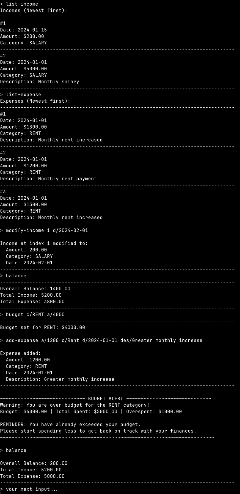

# FinTrack

FinTrack is a lightning-fast, keyboard-first desktop finance tracker built for NUS CEG undergraduates who live in a terminal. It lets you capture expenses and income in seconds, set custom categorical budgets, and get clear summaries without ever leaving the keyboard—or your desktop.

## Documentation

- [User Guide](UserGuide.md) - Complete command reference and usage examples
- [Developer Guide](DeveloperGuide.md) - Architecture and implementation details
- [About Us](AboutUs.md) - Meet the development team

## UI Teaser

## Key Features

- **Fast Expense & Income Tracking**: Add transactions quickly with simple commands
- **Budget Management**: Set budgets for expense categories and get warnings when approaching limits
- **Monthly Filtering**: View transactions and balance for specific months
- **Smart Summaries**: Get breakdowns of spending and income by category
- **Data Export**: Export all data to CSV for backup and analysis
- **Money-Saving Tips**: Get contextual tips to help save money
- **Command Aliases**: Use shortcuts like `ae` for `add-expense` for faster typing

## Quick Start

1. **Install Java 17** - FinTrack requires Java 17
2. **Download FinTrack** - Clone the repository or download the JAR file
3. **Run the application** - Use `java -jar fintrack.jar` or `./gradlew run`
4. **Type `help`** - See all available commands and examples
